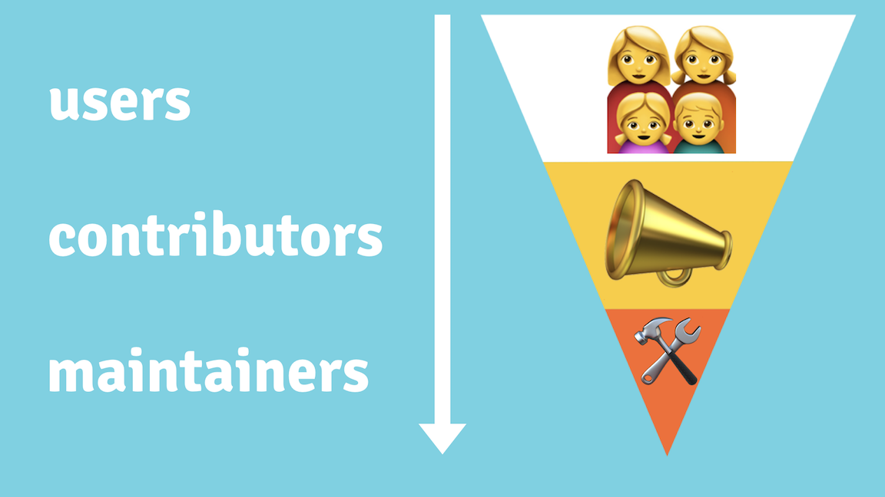

# Building Welcoming Communities

*Building a community that encourages people to use, contribute to, and evangelize your project.*

> **This is a Markdown fork of: <https://opensource.guide/building-community/>**

**Table of Contents:**

- [Building Welcoming Communities](#building-welcoming-communities)
  - [Section 1: Setting your project up for success](#section-1-setting-your-project-up-for-success)
    - [Make people feel welcome](#make-people-feel-welcome)

## Section 1: Setting your project up for success

*You’ve launched your project, you’re spreading the word, and people are checking it out. Awesome! Now, how do you get them to stick around?*

A welcoming community is an investment into your project’s future and reputation. If your project is just starting to see its first contributions, start by giving early contributors a positive experience, and make it easy for them to keep coming back.

### Make people feel welcome

One way to think about your project’s community is through what \@MikeMcQuaid calls the [contributor funnel](https://mikemcquaid.com/2018/08/14/the-open-source-contributor-funnel-why-people-dont-contribute-to-your-open-source-project/):

As you build your community, consider how someone at the top of the funnel (a potential user) might theoretically make their way to the bottom (an active maintainer). Your goal is to reduce friction at each stage of the contributor experience. When people have easy wins, they will feel incentivized to do more.

